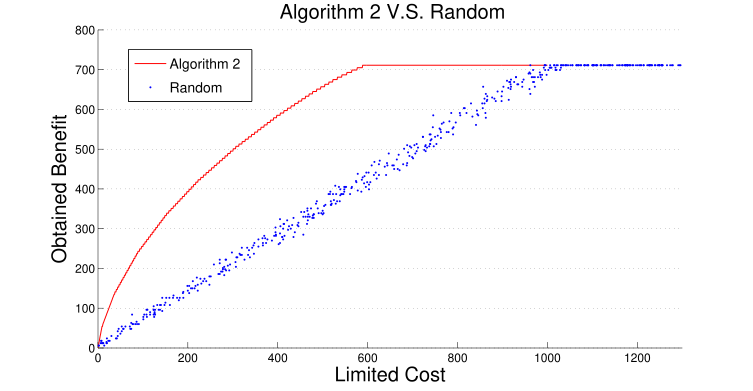
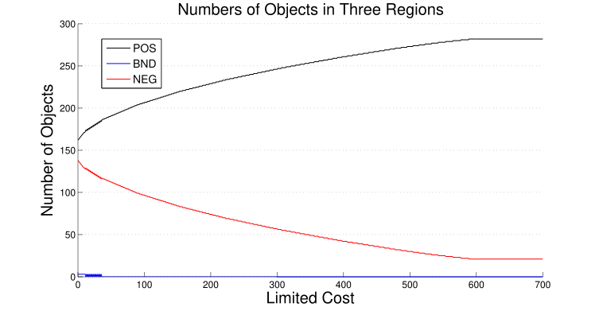
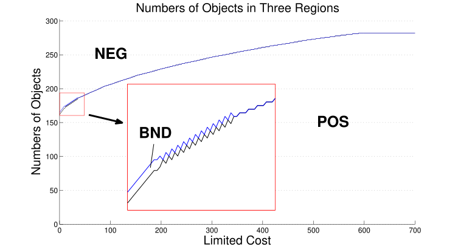

# What is A3WD
A3WD stands for Actionable strategis in 3-Way Decisions, introduced in may paper [Actionable strategies in three-way decisions](http://www.sciencedirect.com/science/article/pii/S0950705117303179).

## Four Models in A3WD
There are four models in A3WD, in which two models find the bounds of cost and benefit, the other two models search for maximum benefit under limited cost and minimum cost for obtaining a desired benefit.

## Code
The package includes the code of four proposed algorithms for these models together with experimental results and several preprocessed data sets (UCI data sets). The code was implemented in Matlab.
Recently, A3WD has been attracting many people's attention, so this package is a good start point if you want to use this method in your research or applications.

## Repository Structure
- A3WDJ folder contains Matlab code and experiment resulsts (figures)
  - All .m and .mat files in this folder are Matlab code and data.
  - figs folder contains generated experiment figures.
- pics folder contains coverted .svg format figures from those .eps format ones located in A3WDJ/figs.

Some experiment results are shown in following figures.

